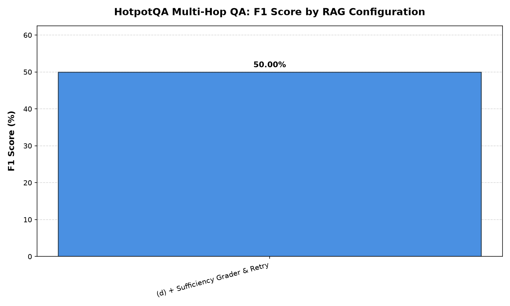

# Agentic RAG Multi-Hop QA: Ablation & Reliability Results

Evaluation performed on the HotpotQA distractor validation split using local `llama3.2` and `nomic-embed-text`.

## 1. Accuracy and Retrieval Ablation

| Configuration | Exact Match | F1 Score | Retrieval Recall@3 | Avg Latency |
|---|---|---|---|---|
| (d) + Sufficiency Grader & Retry | 40.00% | 50.00% | 80.00% | 43.98s |

## 2. Small-Model Self-Critique Reliability Tracking

Tracks structured output adherence, validation failures, and retry exhaustion for `llama3.2`.

| Reliability Metric | Count / Total | Failure / Fallback Rate |
|---|---|---|
| Decomposition calls returning malformed JSON (fallback triggered) | 1 / 5 | **20.00%** |
| Sufficiency Grader calls returning malformed JSON | 3 / 16 | **18.75%** |
| Questions hitting 2-retry cap without confirmed sufficiency | 3 / 5 | **60.00%** |

